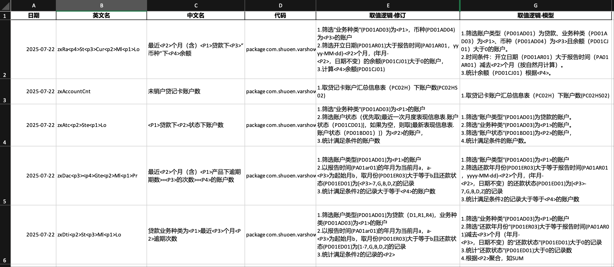

# 征信变量逻辑自动生成工具

本项目旨在构建一个基于大语言模型（DeepSeek-R1-0528-Qwen3-8B）的变量逻辑自动生成工具，用于辅助征信变量开发过程中的字段取值逻辑撰写。通过输入变量名称与 Java 实现代码，结合字段字典和示例逻辑，模型可自动生成清晰、结构化的中文描述逻辑，提升变量开发的标准化程度与开发效率。

---

## 一、项目背景

在征信建模过程中，变量的取值逻辑常常需要由工程师手动编写。这一过程不仅耗时、重复、缺乏标准化，还容易产生歧义或不一致的文档记录。本项目通过示例驱动提示（few-shot prompting）与字段字典融合，为 Java 实现代码生成自然语言取值逻辑描述，适用于审阅、归档与模型解释。

---

## 二、项目结构说明

```

.
├── main.py                          # 主脚本，控制变量处理逻辑与输出保存
├── config.py                        # API 接口与模型配置
├── api/
│   └── deepseek_client.py          # 调用 DeepSeek 模型 API 的封装模块
├── prompts/
│   └── logic_prompt_builder.py     # 构造提示词（Prompt）的核心逻辑
├── data/
│   └── input_loader.py             # Excel 文件读取与字段字典预处理
├── examples/
│   ├── 一阶段：变量示例_k1.0_20250722.xlsx
│   ├── 一阶段：变量示例_k1.1_20250728.xlsx
│   └── CC16_二征征信衍生变量库输入数据字典.xlsx
├── output/
│   └── 变量逻辑生成结果.xlsx       # 模型生成的取值逻辑结果

````

---

## 三、运行依赖

建议使用 Python 3.8 或以上版本。请使用以下命令安装依赖项：

```bash
pip install -r requirements.txt
````

主要依赖库包括：

* pandas
* requests
* openpyxl

---

## 四、配置参数说明

请在 `config.py` 文件中填写以下配置信息：

```python
API_KEY = "your_api_key_here"
API_URL = "https://api.siliconflow.cn/v1/chat/completions"
MODEL_NAME = "deepseek-ai/DeepSeek-R1-0528-Qwen3-8B"
```

---

## 五、使用方法

### 1. 准备输入文件

请确保以下文件已存放于 `examples/` 文件夹中：

* `一阶段：变量示例_k1.0_20250722.xlsx`：包含 few-shot 示例
* `一阶段：变量示例_k1.1_20250728.xlsx`：包含待生成的变量
* `CC16_二征征信衍生变量库输入数据字典.xlsx`：包含字段中文说明和附录代码表

### 2. 启动主程序

在命令行执行：

```bash
python main.py
```

可选参数在 `main.py` 顶部定义：

```python
START_ROW = 0       # 从指定行开始处理，支持中断续跑
MAX_ROWS = None     # 限定最大处理条数（用于调试）
```

### 3. 查看结果

所有模型生成的逻辑描述将被自动写入：

```
output/变量逻辑生成结果.xlsx
```

---

## 六、输入数据说明

### 示例变量文件：`一阶段：变量示例_k1.0_20250722.xlsx`

| 中文名           | 代码        | 取值逻辑-示例              |
| ------------- | --------- | -------------------- |
| 最近\<P2>个月（含）… | Java 源码片段 | 1. 筛选… 2. 筛选… 3. 聚合… |
| 未销户贷记卡账户数     | …         | 直接取 PC02HS02 字段      |

### 字段字典文件：`CC16_二征征信衍生变量库输入数据字典.xlsx`

* 字段字典 sheet：包含字段名、中文释义、表名、字段说明
* 附录 sheet：包含代码表、字段名、字段值、含义，用于模型推理辅助解释字段含义

---

## 七、Prompt 结构说明

模型输入采用 Few-Shot Prompting 策略，格式如下：

```text
你是一个征信建模专家。你将根据变量名称、Java 源代码以及字段字典，生成结构化、标准化的中文“取值逻辑说明”。

【示例】
变量名：<中文名>
Java代码：
<Java代码>
取值逻辑：
1. ...
2. ...
3. ...

请根据以下内容生成取值逻辑：
变量名：{变量名}
Java代码：{Java代码}
字段字典（供参考）：{字段表格markdown格式}
```

提示词中插入 few-shot 示例和字段字典结构，确保输出逻辑的可读性与完整性。

---

---

## 八、输出结果示例预览

模型处理后生成的结果将自动写入 `output/变量逻辑生成结果.xlsx` 文件。以下为部分示例截图：



- 左侧为变量中文名与 Java 实现代码
- 中间为 few-shot 示例提供的参考逻辑
- 右侧为模型生成的中文取值逻辑

---

## 九、功能特性

* 支持逐条处理，每条完成后立即写入文件，避免中途意外中断
* 支持设置起始行和最大处理行，方便调试或断点恢复
* 支持附录字段补全代码表名称，适配空值行结构
* 自动统计每条变量处理时间与总耗时

---

## 十、维护与拓展建议

未来可拓展功能包括：

* 多模型支持（如 Qwen、GLM、Claude）
* UI 可视化界面用于业务人员审阅
* 增强字段推理与嵌套逻辑识别能力
* 接入向量数据库以增强字段语义匹配能力

---

## 十一、致谢

本项目基于真实变量开发流程构建，感谢模型组与数据治理团队提供的字段规范与示例数据支持。特别感谢 DeepSeek 提供的开放模型接口，为变量逻辑生成提供了强大基础能力。

